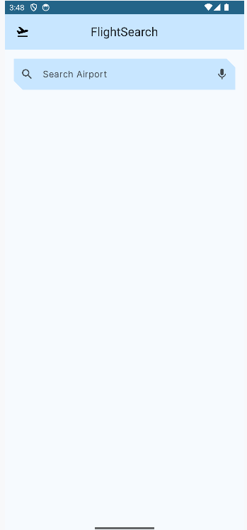
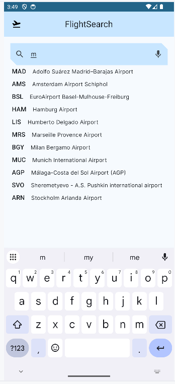
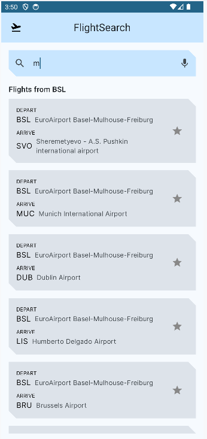
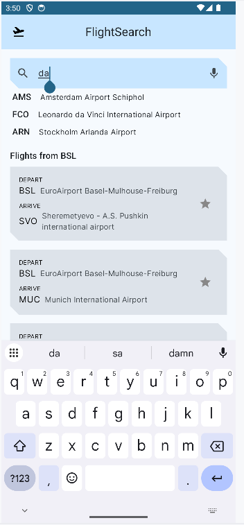

# ✈️ **FlightSearch**
**FlightSearch** is a modern Android application that allows users to search for flights departing from any airport using IATA codes or airport names. It offers real-time auto-suggestions based on a local Room database, and allows users to save their favorite routes. The app follows modern Android development practices with **Room**, **ViewModel**, **StateFlow**, and **Preferences DataStore**, structured around the **MVVM** architecture.

## ✅ **LAST MAJOR UPDATES**

- 🔍 Search screen UI implemented :
  - Added a TextField for airport search input.
  - Displayed filtered airport suggestions from Room in real-time.

- ✈️ Flight routes feature added:
   - Displayed a list of available routes after selecting a departure airport.
   - Flight route data is fetched from Room.

- 💾 Search query persistence via DataStore:
   - The search query is saved on every input change.
   - The last saved query is automatically restored when reopening the app.
      
## ❌ **NEXT UPDATES**

- ❤️ Add favorites logic (DataStore + Room):
  - Mark routes as favorites and persist selection.
  - Display favorite routes when no search is active.

- 🎨 UI improvements:
   - Polish visuals of airport suggestions and flight cards.
   - Improve layout spacing, alignment, and typography for better readability.
   - Add transition/animation effects where relevant.

## 📋 **Features**

   - 🔎 **Search Flights** :

      - ✅ **DONE** Suggest airports with search input.
      - ✅ **DONE** Show destination list from selected airport.
      - ✅ **DONE** Display airport name + IATA code from DB.
   
   - ❤️ **Favorites Management** :

      - 🟩 **IN PROGRESS** Save and delete favorite flight routes.
      - 🟩 **IN PROGRESS** Show favorites when no search is typed.

   - 💾 **Preferences**:

      - ✅ **DONE** Save latest search input via Preferences DataStore.
      - ✅ **DONE** Restore search text and display related results at app launch.

   - 🎨 Modern and Fluid Interface:

      - 🟩 **IN PROGRESS** Follows Material Design 3 guidelines.
      - 🟩 **IN PROGRESS** Smooth transitions with Navigation Component.
      - 🟩 **IN PROGRESS** Responsive layout with adaptive UI.

      - TopBar:
         - ✅ **DONE** Display application title and possible future actions.

      - Light/Dark Mode:
         - ✅ **DONE** Supports **light/dark mode**.

      - Custom theme:
         - ✅ **DONE** Implemented custom colors and shapes.
         - ✅ **DONE** Implemented **Google font** "Urbanist" and "Inter".

   - 🔄 Real-time status management:

      - ✅ **DONE** Use of StateFlow for UI state handling.
      - ✅ **DONE** ViewModel for lifecycle-aware logic.
      - ✅ **DONE** Coroutines for async data operations.

   - 📦 Data Persistence:

      - ✅ **DONE** Persist airports and favorites data locally using Room (SQLite).
      - 🟩 **IN PROGRESS** Automatically restore datas after app restart.

   - 🧠 Architecture & Code Structure:

      - 🟩 **IN PROGRESS** MVVM architecture pattern.
      - 🟩 **IN PROGRESS** Clean separation between UI and business logic.

   - 🚀 Performance and responsiveness:
   
      - 🟩 **IN PROGRESS** Optimize UI scrolling and animations.
      
   - 🛠 Error Handling & User Feedback:

      - ❌ **NOT IMPLEMENTED** : To define.

## 🛠️ **Tech Stack**

   - **Kotlin**: Modern, concise language for Android development.
   - **Jetpack Compose**: Declarative UI toolkit for Android.
   - **Material 3**: Modern, accessible user interface.
   - **Kotlin Flow**: Reactive streams for data.
   - **StateFlow**: Reactive state management for real-time updates.
   - **ViewModel**: MVVM architecture to separate business logic from user interface.
   - **Room**: Local database with DAO and entities;
   - **State Management**: Handle states with MutableStateOf and StateFlow.
   - **Navigation Component**: Seamless screen transitions.
   - **Coroutines**: Async programming made simple.
   - **DataStore**: Modern replacement for SharedPreferences.
   
## 🚀 **How to Use**
1. **Launch the app**:
   - Download the code and launch the app on an Android device or emulator. (Bad performance because in Debug Build Variant)
2. **Search for airports:**:
   - Start typing an airport name or IATA code in the search bar on the Home Screen.
   - Suggestions will appear in real-time based on your input using Room local database.
3. **Select a departure airport**:
   - Tap a suggestion to select it as your departure airport.
   - The app displays a list of all destinations available from that airport.
4. ** Explore flight routes**:
   - Scroll vertically through the list of available flight routes.
   - Each route shows both departure and destination airport details.
5. **Return and search again**:
   - Last query was saved and display at re openning.
   - You can type new keywords anytime to search again.
   - The UI updates instantly with relevant airport and flight results.

## 📸 **Screenshots**

- **Initial screen**:

   
   
- **Suggestions screen**:

   

- **Flight routes screen**:

   

- **Suggestions flight routes screen**:

   

## 🤝 **Contributions**
Contributions are welcome! Feel free to fork the repository and submit a pull request for new features or bug fixes✅🟩❌.